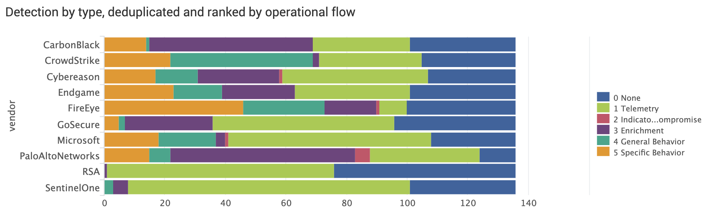

# EDR evaluation app for Splunk 

This app for Splunk accompanies two blog posts about the MITRE ATTACK Endpoint Detection and Response (EDR) results for:

1. [APT3](https://medium.com/@jorritfolmer/comparing-evaluations-of-endpoint-detection-and-response-edr-solutions-eb6bbcb20fad). 
2. [APT29](https://medium.com/@jorritfolmer/detecting-apt29-mitre-edr-evaluations-round-2-a8dcf7a3f486)

It shows data and dashboards from the JSON data published in the [MITRE ATTACK evaluations](https://mitre-engenuity.org/attackevaluations/)

## Why does this Splunk app exist?

To make it easier to play with the EDR evaluation results. The JSON files from MITRE weren't that friendly for slicing and dicing in Splunk, so I write a Python script to [transpose them for APT3](https://gist.github.com/jorritfolmer/2a606c9936674ff9e15677185b8cda86), [APT29](https://gist.github.com/jorritfolmer/c623f8cc2281245714484210813f9ca5) and [Carbanak+FIN7](https://gist.github.com/jorritfolmer/98250b6abb14fd320d93cf17201d5eaf), and included that data in this app for onboarding in Splunk.

## How do I use this app?

1. Install from Splunkbase (or git clone from Github, if you download the .zip file please remember to rename the directory to "EDRevals")
2. Look at the dashboards and draw your own conclusions 
3. If unsatisfied, create your own queries
4. (Optionally drop me a line about your own query adventures.)

## Example

The opinionated bar chart below shows how many of the APT3 steps were detected by which main detection type. For more information about the main detection types see the [MITRE explanation](https://attackevals.mitre-engenuity.org/enterprise/APT3/#detection-categories)

More charts available in the companion [EDR evaluation results post for APT3](https://medium.com/@jorritfolmer/comparing-evaluations-of-endpoint-detection-and-response-edr-solutions-eb6bbcb20fad) or [APT29](https://medium.com/@jorritfolmer/detecting-apt29-mitre-edr-evaluations-round-2-a8dcf7a3f486)

## LICENSE

The MITRE Corporation (MITRE) hereby grants you a non-exclusive, royalty-free license to use ATT&CK Evaluations for research, development, and commercial purposes. Any copy you make for such purposes is authorized provided that you reproduce MITRE's copyright designation and this license in any such copy.

"(C) 2018 The MITRE Corporation. This work is reproduced and distributed with the permission of The MITRE Corporation."

DISCLAIMERS
MITRE does not claim ATT&CK enumerates all possibilities for the types of actions and behaviors documented as part of its adversary model and framework of techniques. Using the information contained within ATT&CK to address or cover full categories of techniques will not guarantee full defensive coverage as there may be undisclosed techniques or variations on existing techniques not documented by ATT&CK.

ALL DOCUMENTS AND THE INFORMATION CONTAINED THEREIN ARE PROVIDED ON AN "AS IS" BASIS AND THE CONTRIBUTOR, THE ORGANIZATION HE/SHE REPRESENTS OR IS SPONSORED BY (IF ANY), THE MITRE CORPORATION, ITS BOARD OF TRUSTEES, OFFICERS, AGENTS, AND EMPLOYEES, DISCLAIM ALL WARRANTIES, EXPRESS OR IMPLIED, INCLUDING BUT NOT LIMITED TO ANY WARRANTY THAT THE USE OF THE INFORMATION THEREIN WILL NOT INFRINGE ANY RIGHTS OR ANY IMPLIED WARRANTIES OF MERCHANTABILITY OR FITNESS FOR A PARTICULAR PURPOSE.
